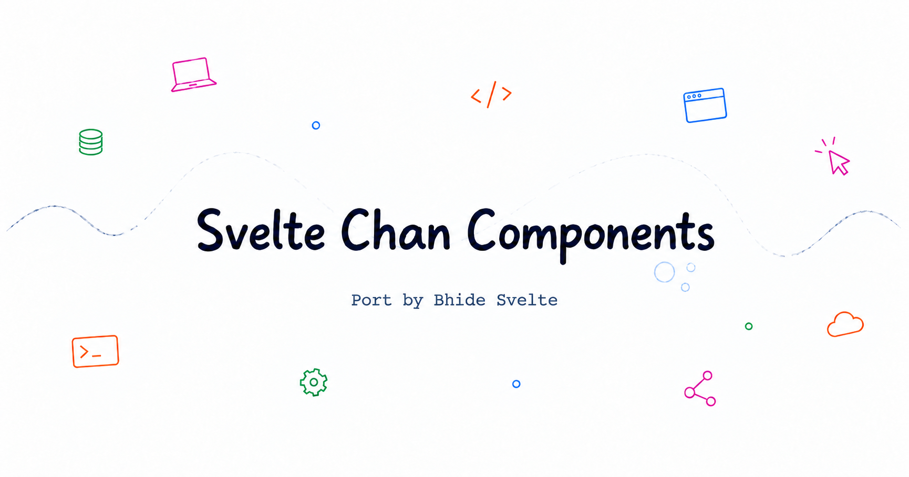

# Svelte Chanhdai Components & Blocks



A collection of free, open-source Svelte 5 components ported from [Chánh Đại's original work](https://chanhdai.com/components).

[Browse components](https://sv-chan.vercel.app) · [Contribute](./CONTRIBUTING.md) · [Sponsor](https://github.com/sponsors/ncdai)

## Features

- Built for Svelte 5 and SvelteKit
- Easy installation with the shadcn-svelte CLI
- Polished animations and interactions
- Live previews with practical examples
- Open source and ready to customize

## Local development

```bash
pnpm install
pnpm dev
```

See [CONTRIBUTING.md](./CONTRIBUTING.md) to add a new component or block.

## Sponsor

- [Sponsor Chánh Đại](https://github.com/sponsors/ncdai) — support the original work.
- [Sponsor the Svelte port](https://github.com/sponsors/SikandarJODD) — support more components and docs.

## Credits

Original components and design inspiration by [Chánh Đại](https://chanhdai.com). This project ports that work to Svelte for the community.

## License

Released under the [MIT License](./LICENSE).

## Feedback & Share

- [Share on X](https://x.com/intent/post?text=Check%20out%20Svelte%20Chanhdai%20Components%20%26%20Blocks%20by%20%40Sikandar_Bhide%20%E2%80%94%20free%20Svelte%205%20components%20and%20animated%20UI%20blocks.&url=https%3A%2F%2Fsv-chan.vercel.app)
- [Send me a DM on X](https://x.com/messages/compose?recipient_id=1595792880576401408&text=Hi%20Sikandar%2C%20I%20have%20some%20feedback%20about%20Svelte%20Chanhdai%20Components%3A%20)
